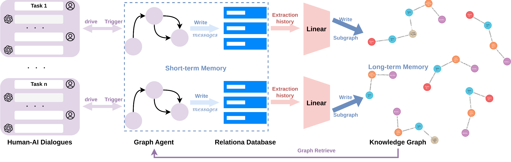

# KECRA (Knowledge-Enhanced Cobot Reasoning Assistant)
KECRA is a framework for language-based control of collaborative robots (cobots) in dynamic construction environments. It combines Large Language Models (LLMs) with Visual Foundation Models (VFMs) to allow human operators to guide robotic assistance through natural language dialogues.
KECRA integrates:
  - Perception module based on SAM + CLIP, providing zero-shot recognition and real-time understanding of objects (type, location, physical dimensions, coordinate frame).
  - State-graph planning agent (LangGraph) that decomposes high-level instructions into verifiable sub-tasks and robot poses using Chain-of-Thought reasoning.
  - Human-in-the-loop feedback loops at key reasoning stages (task plan / pose plan) enabling interactive correction and safe mid-execution adjustments.
  - Memory system combining short-term interaction context and long-term knowledge graph (episodes of past tasks) to improve future reasoning via retrieval-augmented generation.

Workflow:
Instruction → Plan Sub-tasks → Confirm Tasks → Generate Poses → Confirm Poses → Execution (with rewindable checkpoints)

This repository includes code for perception (SAM/CLIP API), state-graph agent (LangGraph), human-AI interaction logic, and knowledge-graph construction/retrieval.

Please cite us if you use the codes: Tang, R., Lorenz, C. L., Frisch, J., van Treeck, C. 2025. Knowledge-Enhanced Cobot Reasoning Assistant for Robot Manipulation. Forum Bauinformatik. Aachen, Germany.


## Installation

### 1. Start ROS2 Rosbridge WebSocket
```bash
ros2 launch rosbridge_server rosbridge_websocket_launch.xml
```
This command launches the ROS2 Rosbridge WebSocket server.
It creates a WebSocket interface that allows the Angular frontend to communicate with the ROS2 nodes, enabling JSON-based message exchange between the web UI and the robot.

### 2. Start Angular15 frontend
```bash
cd ur5e_control_UI_v2
ng serve
```
By default, the chatbot UI will be available at http://localhost:4200.
Through this interface, users can enter natural language instructions, which are forwarded to the backend Agent. The Agent processes them and coordinates with the ROS2 system, enabling interactive dialogue-based control of the robot.


### 3. Run backend Agent
```bash
cd dual_arms_manipulation_agent_v1
uvicorn main:app --reload
```
This step starts the backend Agent service using FastAPI, exposing HTTP APIs built on LangGraph.


### 4. Launch Gazebo simulation
```bash
cd ur5e_SAM_CLIP
ros2 launch bringup simulation.launch.py
ros2 launch ur5e_gripper_control demo4.launch.py
```
This step launches the Gazebo simulation environment with dual UR5e robotic arms for manipulation tasks.
The vision detection module is based on SAM + CLIP for zero-shot object recognition and pose estimation.
For detailed Gazebo environment setup and configuration, please refer to: [UR5e_Vision_Assemble](https://github.com/zitongbai/UR5e_Vision_Assemble.git).


### 5. Build knowledge graph
```bash
python neo4j_generation.py
```
Each time a task is completed, run this script to export the interaction records from the SQLite dialogue database into the Neo4j graph database, thereby enriching the knowledge graph.
⚠️ Note: before each run, make sure to update the current dialogue thread number in the script so that the correct interaction history is imported.



## Demonstration


## Acknowledgment
- [Segment Anything (SAM)](https://github.com/facebookresearch/segment-anything.git)  
- [CLIP](https://github.com/openai/CLIP.git)
- [UR5e_Vision_Assemble](https://github.com/zitongbai/UR5e_Vision_Assemble.git)
- [LangGraph](https://github.com/langchain-ai/langgraph.git)


